# **KS0543 Keyestudio Beetlebot 3 in 1 Robot for scratch**

## Description：

The Beetlebot smart robot, compatible with LEGO building blocks, is a STEM
educational product which can automatically dodge obstacles, follow black lines
and light to move. Besides, it has three cool forms such as the soccer robot,
the siege robot, the handling robot. As for beginners, they can create whatever
they want by LEGO building blocks.

Various improvements have been made on the Beetlebot car in comparison with
other smart cars. It integrates a motor driver and a large number of sensors and
is easy to assemble.

Going forward, not only can it impart basic programming knowledge and AI
application to children and the youth, but also it can cultivate their
creativity, hands-on ability, problem-solving capability, interpersonal
communication as well as teamwork ability. With this kit, you have a chance to
experience soccer games using your own robots.

# Features：

-   Compatible with LEGO building blocks: generate diverse forms with LEGO
    blocks and sensors

-   Three forms: a soccer robot, a siege engine, a handling robot

-   Various functions: Pictures display, atmosphere light control, line
    tracking, obstacle avoidance, light following , IR control and WIFI control.

-   Easy to build: embedded design on car body; wire up the car body with a few
    steps

-   High compatibility: reserve ports for the Raspberry Pico board and the ESP32
    control board

-   Charging function: integrate a circuit for 18650 batteries, low-cost and
    effective

-   WiFi Control: adopt WiFi control, can finish tailor-made software
    development

-   App: compatible with Android and iOS systems, with aesthetic page and
    flexible control system

# 3. Specification：

Working voltage: 5V

Input voltage: 2.5V\~4.2V (lithium battery)

Maximum output current: 3A

Maximum power consumption: 15W (T=80℃)

Motor speed: 5V 200 rpm / min

Motor drive form: dual H-bridge

Ultrasonic sensing angle: \<15 degrees

Ultrasonic detection distance: 2cm-400cm

IR control distance: about 7 meters (measured)

Size: 176mm\*137mm\*130mm

Environmental protection attributes: ROHS

# 4. Kit List：

| \# | Picture                                                                                             | Name                                                                                                                                                                                                                                                                                                                                                                                                                                                                                                                                                                                                                                                                                                                                                                                                                                                                                                                                                                                                                                                                                                                                                                                    | QTY |
|----|-----------------------------------------------------------------------------------------------------|-----------------------------------------------------------------------------------------------------------------------------------------------------------------------------------------------------------------------------------------------------------------------------------------------------------------------------------------------------------------------------------------------------------------------------------------------------------------------------------------------------------------------------------------------------------------------------------------------------------------------------------------------------------------------------------------------------------------------------------------------------------------------------------------------------------------------------------------------------------------------------------------------------------------------------------------------------------------------------------------------------------------------------------------------------------------------------------------------------------------------------------------------------------------------------------------|-----|
|    |                                                      | Keyestudio Nano CH340 Development Board                                                                                                                                                                                                                                                                                                                                                                                                                                                                                                                                                                                                                                                                                                                                                                                                                                                                                                                                                                                                                                                                                                                                                 | 1   |
|    |                                                    | ESP8266 Wifi Module                                                                                                                                                                                                                                                                                                                                                                                                                                                                                                                                                                                                                                                                                                                                                                                                                                                                                                                                                                                                                                                                                                                                                                     | 1   |
|    |                                                 | Keyestudio Photoresistor                                                                                                                                                                                                                                                                                                                                                                                                                                                                                                                                                                                                                                                                                                                                                                                                                                                                                                                                                                                                                                                                                                                                                                | 2   |
|    | 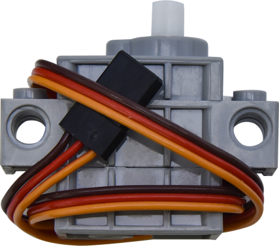                                                   | 270° Servo                                                                                                                                                                                                                                                                                                                                                                                                                                                                                                                                                                                                                                                                                                                                                                                                                                                                                                                                                                                                                                                                                                                                                                              | 1   |
|    | 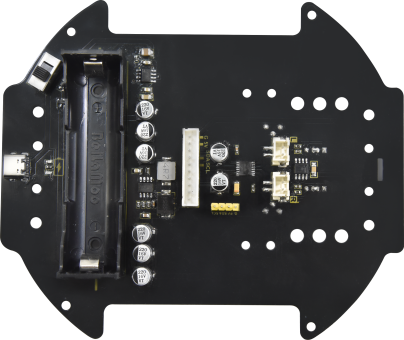                                                   | Keyestudio Development Board                                                                                                                                                                                                                                                                                                                                                                                                                                                                                                                                                                                                                                                                                                                                                                                                                                                                                                                                                                                                                                                                                                                                                            | 1   |
|    |                                                    | Keyestudio Driver Board                                                                                                                                                                                                                                                                                                                                                                                                                                                                                                                                                                                                                                                                                                                                                                                                                                                                                                                                                                                                                                                                                                                                                                 | 1   |
|    |                                                    | LEGO Bulk Lot                                                                                                                                                                                                                                                                                                                                                                                                                                                                                                                                                                                                                                                                                                                                                                                                                                                                                                                                                                                                                                                                                                                                                                           | 1   |
|    |                                                    | Acrylic Board                                                                                                                                                                                                                                                                                                                                                                                                                                                                                                                                                                                                                                                                                                                                                                                                                                                                                                                                                                                                                                                                                                                                                                           | 1   |
|    | 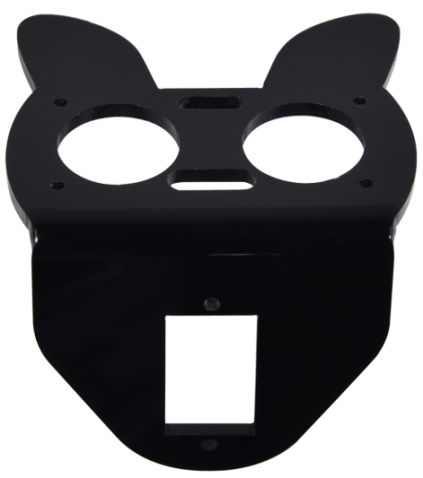                                                   | MD0487 Acrylic Board for Ultrasonic Sensor                                                                                                                                                                                                                                                                                                                                                                                                                                                                                                                                                                                                                                                                                                                                                                                                                                                                                                                                                                                                                                                                                                                                              | 1   |
|    |                                                     | Acrylic Board for Servo                                                                                                                                                                                                                                                                                                                                                                                                                                                                                                                                                                                                                                                                                                                                                                                                                                                                                                                                                                                                                                                                                                                                                                 | 1   |
|    |                                                     | 4.5V 200R Motor                                                                                                                                                                                                                                                                                                                                                                                                                                                                                                                                                                                                                                                                                                                                                                                                                                                                                                                                                                                                                                                                                                                                                                         | 2   |
|    | 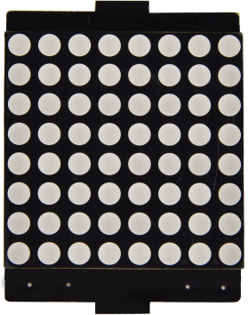                                                   | 8\*8 Dot Matrix Display                                                                                                                                                                                                                                                                                                                                                                                                                                                                                                                                                                                                                                                                                                                                                                                                                                                                                                                                                                                                                                                                                                                                                                 | 1   |
|    |                                                     |  Aluminum Block | 2   |
|    |                                                    | 9G 180°Servo                                                                                                                                                                                                                                                                                                                                                                                                                                                                                                                                                                                                                                                                                                                                                                                                                                                                                                                                                                                                                                                                                                                                                                            | 1   |
|    |                                                    | Car Wheel                                                                                                                                                                                                                                                                                                                                                                                                                                                                                                                                                                                                                                                                                                                                                                                                                                                                                                                                                                                                                                                                                                                                                                               | 2   |
|    |                                                     | HC-SR04 Ultrasonic Sensor                                                                                                                                                                                                                                                                                                                                                                                                                                                                                                                                                                                                                                                                                                                                                                                                                                                                                                                                                                                                                                                                                                                                                               | 1   |
|    | 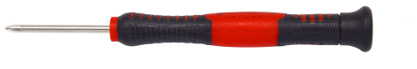                                                   | Screwdriver     | 1   |
|    |                                                     | W420 Universal Wheel                                                                                                                                                                                                                                                                                                                                                                                                                                                                                                                                                                                                                                                                                                                                                                                                                                                                                                                                                                                                                                                                                                                                                                    | 1   |
|    |                                              | JMFP-4 17-Key Remote Control                                                                                                                                                                                                                                                                                                                                                                                                                                                                                                                                                                                                                                                                                                                                                                                                                                                                                                                                                                                                                                                                                                                                                            | 1   |
|    |                                                     | Black USB Cable                                                                                                                                                                                                                                                                                                                                                                                                                                                                                                                                                                                                                                                                                                                                                                                                                                                                                                                                                                                                                                                                                                                                                                         | 1   |
|    |                                                | Screwdriver                                                                                                                                                                                                                                                                                                                                                                                                                                                                                                                                                                                                                                                                                                                                                                                                                                                                                                                                                                                                                                                                                                                                                                             | 1   |
|    |                                                     | 3P F-F Dupont Wire                                                                                                                                                                                                                                                                                                                                                                                                                                                                                                                                                                                                                                                                                                                                                                                                                                                                                                                                                                                                                                                                                                                                                                      | 2   |
|    |                                                     | 4P F-F Dupont Wire                                                                                                                                                                                                                                                                                                                                                                                                                                                                                                                                                                                                                                                                                                                                                                                                                                                                                                                                                                                                                                                                                                                                                                      | 1   |
|    | 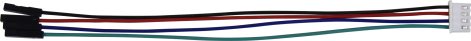                                                    | HX2.54mm-4P Dupont Wire                                                                                                                                                                                                                                                                                                                                                                                                                                                                                                                                                                                                                                                                                                                                                                                                                                                                                                                                                                                                                                                                                                                                                                 | 1   |
|    |                                             | Winding Pipe                                                                                                                                                                                                                                                                                                                                                                                                                                                                                                                                                                                                                                                                                                                                                                                                                                                                                                                                                                                                                                                                                                                                                                            | 1   |
|    |                                                    | 10P XH2.54 Dupont Wire                                                                                                                                                                                                                                                                                                                                                                                                                                                                                                                                                                                                                                                                                                                                                                                                                                                                                                                                                                                                                                                                                                                                                                  | 1   |
|    |                                                    | Acrylic Gasket                                                                                                                                                                                                                                                                                                                                                                                                                                                                                                                                                                                                                                                                                                                                                                                                                                                                                                                                                                                                                                                                                                                                                                          | 6   |
|    | 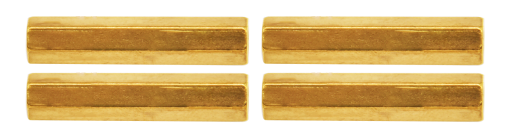                                                   | M3\*40MM Dual Pass Copper Pillars                                                                                                                                                                                                                                                                                                                                                                                                                                                                                                                                                                                                                                                                                                                                                                                                                                                                                                                                                                                                                                                                                                                                                       | 4   |
|    | 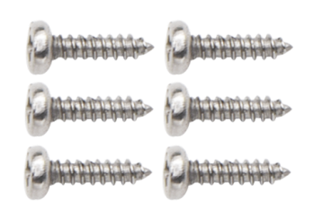                                                   | M1.2\*5MM Round Head Screws                                                                                                                                                                                                                                                                                                                                                                                                                                                                                                                                                                                                                                                                                                                                                                                                                                                                                                                                                                                                                                                                                                                                                             | 6   |
|    |   | M1.4 Nuts                                                                                                                                                                                                                                                                                                                                                                                                                                                                                                                                                                                                                                                                                                                                                                                                                                                                                                                                                                                                                                                                                                                                                                               | 6   |
|    |                                                      | M1.4\*10MM Round Head Screws                                                                                                                                                                                                                                                                                                                                                                                                                                                                                                                                                                                                                                                                                                                                                                                                                                                                                                                                                                                                                                                                                                                                                            | 6   |
|    |                                                    | M2 Nuts                                                                                                                                                                                                                                                                                                                                                                                                                                                                                                                                                                                                                                                                                                                                                                                                                                                                                                                                                                                                                                                                                                                                                                                 | 3   |
|    |                                                    | M2\*8MM Round Head Screws                                                                                                                                                                                                                                                                                                                                                                                                                                                                                                                                                                                                                                                                                                                                                                                                                                                                                                                                                                                                                                                                                                                                                               | 3   |
|    | 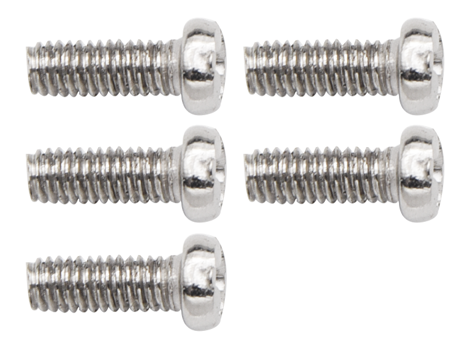  | M3\*10MM Round Head Screws                                                                                                                                                                                                                                                                                                                                                                                                                                                                                                                                                                                                                                                                                                                                                                                                                                                                                                                                                                                                                                                                                                                                                              | 6   |
|    |                                                      | M3\*6MM Round Head Screws                                                                                                                                                                                                                                                                                                                                                                                                                                                                                                                                                                                                                                                                                                                                                                                                                                                                                                                                                                                                                                                                                                                                                               | 11  |
|    |                                                    | M3 Nuts                                                                                                                                                                                                                                                                                                                                                                                                                                                                                                                                                                                                                                                                                                                                                                                                                                                                                                                                                                                                                                                                                                                                                                                 | 9   |
|    |                                                    | M3\*30MM Round Head Screws                                                                                                                                                                                                                                                                                                                                                                                                                                                                                                                                                                                                                                                                                                                                                                                                                                                                                                                                                                                                                                                                                                                                                              | 4   |
|    |                                                     | Soccer Ball                                                                                                                                                                                                                                                                                                                                                                                                                                                                                                                                                                                                                                                                                                                                                                                                                                                                                                                                                                                                                                                                                                                                                                             | 1   |
|    |                                                    | W1515 Universal Wheel                                                                                                                                                                                                                                                                                                                                                                                                                                                                                                                                                                                                                                                                                                                                                                                                                                                                                                                                                                                                                                                                                                                                                                   | 1   |
|    |                                                    | 18650 Batteries KS0543F includes batteries KS0543 doesn't conclude batteries                                                                                                                                                                                                                                                                                                                                                                                                                                                                                                                                                                                                                                                                                                                                                                                                                                                                                                                                                                                                                                                                                                            | 1   |
|    | 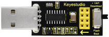                                              |  USB to ESP-01S WIFI Module Expansion Board                                                                                                                                                                                                                                                                                                                                                                                                                                                                                                                                                                                                                                                                                                                                                                                                                                                                                                                                                                                                                                                                                                                                             | 1   |

# How to install the Beetlebot car：

# 6. PCB Board：

****

****

**Turn the DIP switch to the OFF end before installing or removing batteries**

# Interface Setting：

After the KidsBlock is installed，open KidsBlock to
click\<“**Beetlebot**”\<“**Connect**”，

Then the **Beetlebot car is connected.** Click**“Go to Editor”**to return the
code editor.

will change
intoandinto.

This means the **Beetlebot car is connected to the COM port**

假If the car is connected,
butdoesn’t change into

，

Just clickto connect the COM
port.Click，then
click“**Connect**”，after a while, if the“**Connected**”page pops up，the com
port will be connected.

Then click to switch the mode，

The modewill switch
to

# 9. Projects：

## Project 1: LED Blinking

1.  **Description：**

There is an onboard LED (L) on our Arduino Nano board connected to D13. In this
experiment, we WILL make this LED blink.

LED blinking is the most basic experimental project for Arduino enthusiasts.
Let’s get started.

1.  **Knowledge：**

**On-board LED：**

LED, the abbreviation of light emitting diodes, consists of Ga, As, P, N
chemical compounds and so on. It is easy to control through the IO port(D13) of
the Arduino Nano board.

1.  **Test Code**

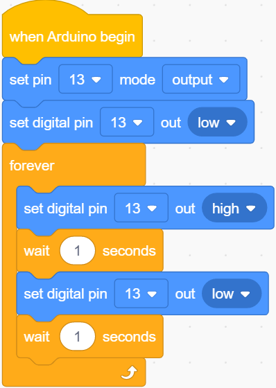

1.  **Test Result：**

Upload the test code to the Arduino Nano board and power up with a USB cable.
Then the on-board LED will flash.

## Project 2: 6812 RGB

1.  **Description：**

There are 4 RGB LEDs can be widely used in the decoration of buildings, bridges,
roads, gardens, courtyards and so on by colors adjustment.

In this experiment, we will demonstrate different lighting effects with them.

1.  **Component Knowledge**

**SK6812RGB:**

From the schematic diagram, we can see that these four pixel lighting beads are
all connected in series. In fact, no matter how many they are, we can use a pin
to control a light and let it display any color. The pixel point contains a data
latch signal shaping amplifier drive circuit, a high-precision internal
oscillator and a 12V high-voltage programmable constant current control part,
which effectively ensures the color of the pixel point light is highly
consistent.

The data protocol adopts a single-wire zero-code communication method. After the
pixel is powered up and reset, the S terminal receives the data transmitted from
the controller. The first 24bit data sent is extracted by the first pixel and
sent to the data latch of the pixel.

1.  **Test Code：**

The SK6812RGB on the PCB board is controlled by the IO port (A3)

1.  **Test Result：**

Upload the test code to the Arduino Nano board and power up by a USB cable. Then
the four RGB lights on the PCB demonstrate multi-color light effect.

## Project 3: Play Music

1.  **Description：**

There is a power amplifier component on the expansion board, which is often used
to play music and serve as an external amplifying device for music playback
devices.

In this experiment, we use the speaker amplifier component to play music.

**2. Knowledge：**

Power amplifier modules(equivalent to a passive buzzer) don’t have internal
oscillation circuits.

The power amplifier module can chime sounds with different frequency when power
it up.

**3. Test Code：**

The speaker component on the PCB board is controlled by the D3 of the Arduino
Nano board.

**4. Test Result：**

Upload the test code to the Arduino Nano board and power up with a USB cable.
Then the power amplifier component will play music

## Project 4: 8\*8 Dot Matrix

1.  **Description：**

Composed of LED emitting tube diodes, the 8\*8 LED dot matrix are applied widely
to public information display like advertisement screen and bulletin board, by
controlling LED to show words, pictures and videos, etc.

**2. Knowledge：**

There are different types of matrices, including 4×4, 8×8 and 16×16 and etc. It
contains 64 LEDs.

The inner structure of 8×8 dot matrix is shown below.

Every LED is installed on the cross point of row line and column line. When the
voltage on a row line increases, and the voltage on the column line reduces, the
LED on the cross point will light up. 8×8 dot matrix has 16 pins. Put the
silk-screened side down and the numbers are 1, 8, 9 and 16 in anticlockwise
order as marked below.

The definition inner pins are shown below:

For instance, to light up the LED on row 1 and column 1, you should increase the
voltage of pin 9 and reduce the voltage of pin 13.

**HT16K33 8X8 Dot Matrix**

The HT16K33 is a memory mapping and multi-purpose LED controller driver. The
max. Display segment numbers in the device is 128 patterns (16 segments and 8
commons) with a 13\*3 (MAX.) matrix key scan circuit. The software configuration
features of the HT16K33 makes it suitable for multiple LED applications
including LED modules and display subsystems. The HT16K33 is compatible with
most microcontrollers and communicates via a two-line bidirectional I2C-bus.

The picture below is the working schematic of HT16K33 chip

We design the drive module of 8\*8 dot matrix based on the above principle. We
could control the dot matrix by I2C communication and two pins of
microcontroller, according to the above diagram.

**Specification:**

-   Input voltage: 5V

-   Rated input frequency: 400KHZ

-   Input power: 2.5W

-   Input current: 500mA

4\. Introduction for Modulus Tool

The online version of dot matrix modulus tool:

[http://dotmatrixtool.com/\#](http://dotmatrixtool.com/)

①Open the link to enter the following page.

②The dot matrix is 8\*8 in this project. So set the height to 8, width to 8; as
shown below.

③Click **Byte order** to select **Row major**

③ Generate hexadecimal data from the pattern

As shown below, the left button of the mouse is for selection while the right is
for canceling. Thus you could use them to draw the pattern you want, then click
**Generate**, to yield the hexadecimal data needed.

The generated hexadecimal code（0x00, 0x66, 0x00, 0x00, 0x18, 0x42, 0x3c, 0x00)
is what will be displayed, so you need to save it for next procedure.

1.  **Wiring up：**

| 8\*8 Dot matrix display | PCB Board |
|-------------------------|-----------|
| G                       | G         |
| 5V                      | 5V        |
| SDA                     | SDA       |
| SCL                     | SCL       |

**3. Test Code：**

The 8\*8 dot matrix is controlled by A4（SDA）and A5（SCL）of the Arduino Nano
board.

1.  **Test Result：**

Upload the test code to the Arduino Nano board and power up by a USB cable, the
8\*8 dot matrix display will show show patterns.

## Project 5: Servo Rotation

1.  **Description：**

There are two servos on the car. We take the servo connected to pin D9 as an
example.

The servo is a motor that can rotate very accurately. It has been widely applied
to toy cars, remote control helicopters, airplanes, robots and other fields. In
this project, we will use the Nano motherboard to control the servo to spin.

1.  **Knowledge：**

Servo motor is a position control rotary actuator. It mainly consists of a
housing, a circuit board, a core-less motor, a gear and a position sensor. Its
working principle is that the servo receives the signal sent by MCU or receiver
and produces a reference signal with a period of 20ms and width of 1.5ms, then
compares the acquired DC bias voltage to the voltage of the potentiometer and
obtain the voltage difference output.

When the motor speed is constant, the potentiometer is driven to rotate through
the cascade reduction gear, which leads that the voltage difference is 0, and
the motor stops rotating. Generally, the angle range of servo rotation is 0°
\--180 °

The rotation angle of servo motor is controlled by regulating the duty cycle of
PWM (Pulse-Width Modulation) signal. The standard cycle of PWM signal is 20ms
(50Hz). Theoretically, the width is distributed between 1ms-2ms, but in fact,
it's between 0.5ms-2.5ms. The width corresponds the rotation angle from 0° to
180°. But note that for different brand motors, the same signal may have
different rotation angles.

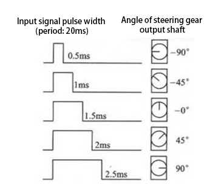

In general, servo has three lines in brown, red and orange. The brown wire is
grounded, the red one is a positive pole line and the orange one is a signal
line.

****

1.  **Wire up：**

| Servo  | PCB Board |
|--------|-----------|
| Brown  | G         |
| Red    | 5V        |
| Orange | S1（D9）  |

1.  **Test Code：**

The servo for controlling the ultrasonic sensor is controlled by the D9 of the
Arduino Nano board.

**5. Test Result：**

Upload the test code to the Arduino Nano board, and power up with a USB cable.
Then the arm of the servo will rotate to 0°, 45°, 90°, 135° and 180°

## Project 6: Motor Driving and Speed Control

1.  **Description：**

There are many ways to drive motors. This car uses the most commonly used
DRV8833 motor driver chip, which provides a dual-channel bridge electric driver
for toys, printers and other motor integration applications.

In this experiment, we use the DRV8833 motor driver chip on the expansion board
to drive the two DC motors, and demonstrate the effect of forward, backward,
left-turning, and right-turning.

1.  **Knowledge：**

DRV8833 motor driver chip: Dual H-bridge motor driver with current control
function, can drive two DC motors, one bipolar stepper motor, solenoid valve or
other inductive loads. Each H-bridge includes circuitry to regulate or limit
winding current.

An internal shutdown function with a fault output pin is used for over-current
and short circuit protection, under-voltage lockout and over-temperature. A
low-power sleep mode is also added. Let's take a look at the schematic diagram
of the DRV8833 motor driver chip driving two DC motors:

If you want to get insight to it, you can check the specification of this chip.
Just browse it in the“Attachments”folder.

**3. Specification：**

Input voltage of logic part: DC 5V

Input voltage of driving part : DC 5V

Working current of logic part: \<30mA

Operating current of driving part: \<2A

Maximum power dissipation: 10W (T=80℃)

Motor speed: 5V 200 rpm / min

Motor drive form: dual H-bridge drive

Control signal input level: high level 2.3V\<Vin\<5V, low level -0.3V\<Vin\<1.5V

Working temperature: -25\~130℃

**4. Drive the car to move**

From the above diagram, the direction pin of the left motor is D4; the speed pin
is D6; D2 is the direction pin of the right motor; and D5 is speed pin.

PWM drives the robot car. The PWM value is in the range of 0-255. The more the
PWM value is set, the faster the rotation of the motor.

| Function   | D4   | D6（PWM） | Left motor    | D2   | D5（PWM） | Right motor   |
|------------|------|-----------|---------------|------|-----------|---------------|
| forward    | LOW  | 200       | clockwise     | LOW  | 200       | clockwise     |
| Go back    | HIGH | 50        | anticlockwise | HIGH | 50        | anticlockwise |
| Turn left  | HIGH | 200       | anticlockwise | LOW  | 200       | clockwise     |
| Turn right | LOW  | 200       | clockwise     | HIGH | 200       | anticlockwise |
| Stop       | LOW  | 0         | stop          | LOW  | 0         | stop          |

**5. Test Code：**

**6.Test Result：**

Upload the test code to the Arduino Nano board, install batteries, turn the
power switch to ON end and power up. The car moves forward for 2s, back for 2s,
turn left for 2s, right for 2s and stops for 2s; cyclically

## Project 7: Ultrasonic Sensor

There is an ultrasonic sensor on the car. It is a very affordable
distance-measuring sensor.

The ultrasonic sensor sends a high-frequency ultrasonic signal that human
hearing can’t hear. When encountering obstacles, these signals will be reflected
back immediately. After receiving the returned information, the distance between
the sensor and the obstacle will be calculated by judging the time difference
between the transmitted signal and the received signal. It is mainly used for
object avoidance and ranging in various robotics projects.

### Project 7.1: Ultrasonic Ranging

**1.Description：**

In this experiment, we use an ultrasonic sensor to measure distance and print
the data on a serial monitor.

1.  **Knowledge：**

The HC-SR04 ultrasonic sensor uses sonar to determine distance to an object like
what bats do. It offers excellent non-contact range detection with high accuracy
and stable readings in an easy-to-use package. It comes complete with ultrasonic
transmitter and receiver modules.

The HC-SR04 or the ultrasonic sensor is being used in a wide range of
electronics projects for creating obstacle detection and distance measuring
application as well as various other applications. Here we have brought the
simple method to measure the distance with Arduino and ultrasonic sensor and how
to use ultrasonic sensor with Arduino.

**Use method and timing chart of ultrasonic module:**

1.  Setting the delay time of Trig pin of SR04 to 10μs at least, which can
    trigger it to detect distance.

2.  After triggering, the module will automatically send eight 40KHz ultrasonic
    pulses and detect whether there is a signal return. This step will be
    completed automatically by the module.

3.  If the signal returns, the Echo pin will output a high level, and the
    duration of the high level is the time from the transmission of the
    ultrasonic wave to the return.

Time=Echo pulse width, unit: us

Distance（cm）=time/ 58

Distance(inch)=time/ 148

The HC-SR04 ultrasonic sensor has four pins: Vcc, Trig, Echo and GND.

The Vcc pin provides power generating ultrasonic pulses and is connected to
Vcc/+5V. The GND pin is grounded/GND.

The Trig pin is where the Arduino sends a signal to start the ultrasonic pulse.
The Echo pin is where the ultrasonic sensor sends information about the duration
of the ultrasonic pulse stroke to the Arduino control board.

**Wiring Up**

| Ultrasonic Sensor | PCB Board |
|-------------------|-----------|
|  Vcc              | 5V        |
| Trig              | S2（D8）  |
| Echo              | S1（D7）  |
| Gnd               | G         |

1.  **Test Code：**

The pin Trig and Echo of the ultrasonic sensor are controlled by the D8 and D7
of the Arduino Nano.

1.  **Test Result：**

Upload the test code to the Arduino Nano board, power up with a USB cable, open
the serial monitor to click  and
set baud rate to 9600.

When you move an object in front of the ultrasonic sensor, it will detect the
distance and the serial monitor will show the distance value.

### Project 7.2: Light Following

**1.Description：**

In the above experiments, we have learned about the 8\*8 dot matrix, motor
drivers and speed regulation, ultrasonic sensors, servos and other hardware. In
this experiment, we will combine them to create a follow car with the ultrasonic
sensor. The can can follow an object to move through

measuring distance.

1.  **Working Principle：**

| Detection   | Detect the front distance    | Distance（unit：cm） |
|-------------|------------------------------|----------------------|
| Condition 1 | Distance＜8                  |                      |
| State       | Go back（set PWM to 100）    |                      |
| Condition 2 | 8≤distance\<13               |                      |
| State       | stop                         |                      |
| Condition 3 | 13≤distance\<35              |                      |
| State       | Go forward（set PWM to 100） |                      |
| Condition 4 | distance≥35                  |                      |
| State       | stop                         |                      |

1.  **Flow Chart：**

**5.Test Result：**

Upload the code to the Arduino Nano board, install batteries and turn the switch
to the ON end and power up. Then the car will follow the obstacle to move.

### Project 7.3: Dodge obstacles

**1.Description：**

In this project, we will take advantage of the ultrasonic sensor to detect the
distance away from the obstacle so as to avoid them

**2. Working Principle：**

|      | 8\*8 Dot matrix display                                |                                                         |                                                 |
|------|--------------------------------------------------------|---------------------------------------------------------|-------------------------------------------------|
|      | Set servo to 90°                                       |                                                         |                                                 |
| loop | Detect the distance away from the obstacle（unit: cm） |                                                         |                                                 |
|      | Condition 1                                            | State                                                   |                                                 |
|      |  0\<distance＜10                                       | Stop                                                    |                                                 |
|      |                                                        | Show the“stop”pattern                                   |                                                 |
|      |                                                        | Set the servo to 180°                                   | Distance away form the obstacle：a1（unit：cm） |
|      |                                                        | Set the servo to 0°                                     | Distance away form the obstacle：a2（unit：cm） |
|      |                                                        | Condition 2                                             | State                                           |
|      |                                                        | a1＜a2                                                  | Car turns right（set PWM to 200）               |
|      |                                                        |                                                         | show“turning right”pattern                      |
|      |                                                        |                                                         | Set servo to 90°                                |
|      |                                                        | a1≥a2                                                   | Turn left（set PWM to 200）                     |
|      |                                                        |                                                         | display“left turning”pattern                    |
|      |                                                        |                                                         | Set servo to 90°                                |
|      | distance≥10                                            | The 8\*8 dot matrix display shows“going forward”pattern |                                                 |
|      |                                                        | Go forward（set PWM to 200）                            |                                                 |

1.  **Flow Chart：**

1.  **Test Code：**

1.  **Test Result：**

Upload the test code to the Arduino Nano board, put batteries in the battery
holder, turn the power switch to the ON end and power up. Then the car can
automatically dodge obstacles

## Project 8: Line Tracking Sensor

There are two IR line tracking sensors on the car. They are actually two pairs
of ST188L3 infrared tubes and used to detect black and white lines. In this
project, we will make a line tracking car

### Project 8.1: Reading Values

**1.Description：**

In this experiment, we use ST188L3 infrared tubes to detect black and white
lines, then print the data on the serial monitor.

**2. Knowledge：**

**Infrared line tracking:**

The IR line tracking sensor boasts a pair of ST188L3 infrared tubes. ST188L3
tubes has an infrared emitting diode and a receiver tube. When the emitting
diode emits an infrared signal then received by the receiving tube after being
reflected by the white object. Once the receiving tube receives the signal, the
output terminal will output a low level (0); when the infrared emitting diode
emits an infrared signal, and the infrared signal is absorbed by the black
object, a high level (1) will be output, thus realizing the function of
detecting signals through infrared rays.

Warning: Reflective optical sensors (including IR line tracking sensors)
shouldn’t be applied under sunlight as there is a lot of invisible light such as
infrared and ultraviolet.

Values detected by the line tracking sensor are shown in the table.

The value will be 1 if detecting black or no objects and the value 0 will appear
if detecting white objects.

he detected black object or no object represents 1, and the detected white
object represents 0.

| Left | Right | Value（Binary ） |
|------|-------|------------------|
| 0    | 0     | 00               |
| 0    | 1     | 01               |
| 1    | 0     | 10               |
| 1    | 1     | 11               |

**3. Test Code：**

The line tracking sensors of the PCB board are controlled by D11 and D10 of the
Arduino Nano baord.

**4. Test Result：**

Upload the test code to the Arduino Nano board, power up with a USB cable, open
the serial monitor to click  and
set baud rate to 9600.

Put a black thing under the line tracking sensor of the car and move it, you
will see different indicators light up, and at the same time you will see the
value on the serial monitor.

The sensitivity can be adjusted by rotating the potentiometer. When the
indicator light is adjusted to the critical point of on and off state, the
sensitivity is the highest.

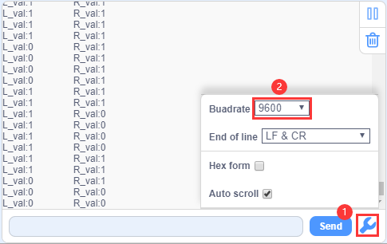

### Project 8.2: Line Tracking

**1.Description：**

We’ve introduced the knowledge of motor drivers, speed regulation, and infrared
line tracking. In this experiment, the car will perform different actions
according to the values transmitted by the infrared tracking.

1.  **Working Principle：**

| Left | Right | Value（Binary ） | State        |
|------|-------|------------------|--------------|
| 0    | 0     | 00               | Stop         |
| 0    | 1     | 01               | Turn right   |
| 1    | 0     | 10               | Turn left    |
| 1    | 1     | 11               | Move forward |

1.  **Flow Chart：**

1.  **Test Code：**

1.  **Test Result：**

Upload the test code to the Arduino Nano board, turn the power switch to the ON
end, power up and put the car on a map we provide. Then it will perform
different functions via values sent by line tracking sensors

## Project 9: Light Following

There are two photoresistors on the car. They can vary with the light intensity
and send information to the Nano board to control the car.

Photoresistors can determine and conduct the car to move by detecting light

### Project 9.1: Read Values

1.  **Description：**

In this experiment, we will learn the working principle of the photoresistor

**2. Knowledge：**

**Photoresistor:**

It mainly uses a photosensitive resistance element whose resistance varies from
the light intensity. The signal terminal of the sensor is connected to the
analog port of the microcontroller. When the light is stronger, the analog value
at the analog port will increase; on the contrary, when the light intensity is
weaker, the analog value of the microcontroller will reduce. In this way, the
corresponding analog value can reflect the ambient light intensity.

**3. Wire up：**

Through the wiring-up diagram, signal pins of two photoresistors are connected
to A6 and A7 of the Nano board.

For the following experiment, we use the photoresistor connected to A6 to finish
experiments. First, let’s read analog values.

| Left photoresistor | PCB board |
|--------------------|-----------|
| G                  | G         |
| V                  | V         |
| S                  | S（A6）   |

**4. Test Code：**

The left photoresistor is controlled by the A6 of the Arduino Nano board.

**5. Test Result：**

Upload the test code to the Arduino Nano board, power up with a USB cable, open
the serial monitor to click  and
set baud to 9600.

When the light intensifies, the analog value will get increased; on the
contrary, the analog value will get reduced.

### Project 9.2: Light Following Car

1.  **Description：**

We have learned the working principle of photoresistor, motor and speed
regulation. In this experiment, we will use a photoresistor to detect the
intensity of light as as to achieve the light following effect.

1.  **Working Principle：**

| Analog value of the left sensor | Analog value of the right sensor | Function      |
|---------------------------------|----------------------------------|---------------|
| \>500                           | \>500                            | Move forward  |
| \>500                           | ≤500                             | Move to left  |
| ≤500                            | \>500                            | Move to right |
| \<500                           | \<500                            | Stop          |

1.  **Wiring up：**

| Left Photoresistor | PCB Board |   | Right photoresistor | PCB Board |
|--------------------|-----------|---|---------------------|-----------|
| G                  | G         |   | G                   | G         |
| V                  | V         |   | V                   | V         |
| S                  | S（A6）   |   | S                   | S（A7）   |

1.  **Flow Chart：**

1.  **Test Code：**

The left and right photoresistors are controlled by A6 and A7 of the Arduino
Nano board.

**6. Test Result：**

Upload the test code to the Arduino Nano board, put batteries in the battery
holder, turn the power switch to the ON end and power up. Then the car will
follow the light to move.

## Project 10: IR Remote Control

Infrared remote controls are everywhere in daily life. It is used to control
various home appliances, such as TV, speakers, video recorders and satellite
signal receivers.

The remote control is composed of an IR emitter, an IR receiver and a decoding
MCU. In this project, we will make a IR remote control car.

### Project 10.1: IR Remote and Reception

**1.Description：**

In this experiment, we will combine the IR receiver and the IR remote control to
read key values and show them on the serial monitor.

1.  **Knowledge：**

**IR Remote Control：**

It is a device with buttons. When the key is pressed, IR signals will be sent.

Infrared remote control technology is widely used, such as TVs, air conditioners
and so on. And it can control air conditioners and TVs

The infrared remote control adopts NEC coding, and the signal period is 110ms.

The remote control is shown below:

Infrared (IR) receiver:

It can receive infrared light and be used to detect the infrared signal emitted
by the infrared remote control.

It can demodulate the received infrared light signal and convert it back to
binary, and then transmit the information to the microcontroller.

**NEC Infrared communication protocol：**

**NEC Protocol**

To my knowledge the protocol I describe here was developed by NEC (Now Renesas).
I've seen very similar protocol descriptions on the internet, and there the
protocol is called Japanese Format.

I do admit that I don't know exactly who developed it. What I do know is that it
was used in my late VCR produced by Sanyo and was marketed under the name of
Fisher. NEC manufactured the remote control IC.

This description was taken from my VCR's service manual. Those were the days,
when service manuals were filled with useful information!

**Features**

-   8 bit address and 8 bit command length.

-   Extended mode available, doubling the address size.

-   Address and command are transmitted twice for reliability.

-   Pulse distance modulation.

-   Carrier frequency of 38kHz.

-   Bit time of 1.125ms or 2.25ms.

**Modulation**

The NEC protocol uses pulse distance encoding of the bits. Each pulse is a 560µs
long 38kHz carrier burst (about 21 cycles). A logical "1" takes 2.25ms to
transmit, while a logical "0" is only half of that, being 1.125ms. The
recommended carrier duty-cycle is 1/4 or 1/3

**Protocol**

The picture above shows a typical pulse train of the NEC protocol. With this
protocol the LSB is transmitted first. In this case Address \$59 and Command
\$16 is transmitted. A message is started by a 9ms AGC burst, which was used to
set the gain of the earlier IR receivers. This AGC burst is then followed by a
4.5ms space, which is then followed by the Address and Command. Address and
Command are transmitted twice. The second time all bits are inverted and can be
used for verification of the received message. The total transmission time is
constant because every bit is repeated with its inverted length. If you're not
interested in this reliability you can ignore the inverted values, or you can
expand the Address and Command to 16 bits each!

Keep in mind that one extra 560µs burst has to follow at the end of the message
in order to be able to determine the value of the last bit.

A command is transmitted only once, even when the key on the remote control
remains pressed. Every 110ms a repeat code is transmitted for as long as the key
remains down. This repeat code is simply a 9ms AGC pulse followed by a 2.25ms
space and a 560µs burst.

**Extended NEC protocol**

The NEC protocol is so widely used that soon all possible addresses were used
up. By sacrificing the address redundancy the address range was extended from
256 possible values to approximately 65000 different values. This way the
address range was extended from 8 bits to 16 bits without changing any other
property of the protocol.

By extending the address range this way the total message time is no longer
constant. It now depends on the total number of 1's and 0's in the message. If
you want to keep the total message time constant you'll have to make sure the
number 1's in the address field is 8 (it automatically means that the number of
0's is also 8). This will reduce the maximum number of different addresses to
just about 13000.

The command redundancy is still preserved. Therefore each address can still
handle 256 different commands.

Keep in mind that 256 address values of the extended protocol are invalid
because they are in fact normal NEC protocol addresses. Whenever the low byte is
the exact inverse of the high byte it is not a valid extended address.

**3.Test Code：**

The IR receiver on the PCB board is controlled by IO port(D12) of the Arduino
Nano board.

**5.Test Result：**

Upload the test code to the Arduino Nano board, power up with a USB cable, open
the serial monitor to click  and
set to 9600.

Press a key on the IR remote control, you will view a code on the serial
monitor. If FFFFFFFF shows up, just ignore it

Code of each key

### Project 10.2: IR Remote Control Car

**1.Description：**

In the above experiment, we have learned about the knowledge of the 8\*8 dot
matrix display, the motor driver and speed regulation, the infrared receiver and
the infrared remote control. In this experiment, we will use the infrared remote
control and the infrared receiver to control the car.

1.  **Working Principle：**

| Keys                                             | Keys Code | Functions                  |
|--------------------------------------------------|-----------|----------------------------|
|   | FF629D    | Go forward                 |
|                                                  |           | Display “forward”pattern   |
|   | FFA857    | Go back                    |
|                                                  |           | Display “back”pattern      |
|   | FF22DD    | Turn left                  |
|                                                  |           | Show“left” pattern         |
|   | FFC23D    | Turn right                 |
|                                                  |           | Show“right turning”pattern |
|   | FF02FD    | stop                       |
|                                                  |           | show“stop”pattern          |

1.  **Flow Chart：**

1.  **Test Code**

    

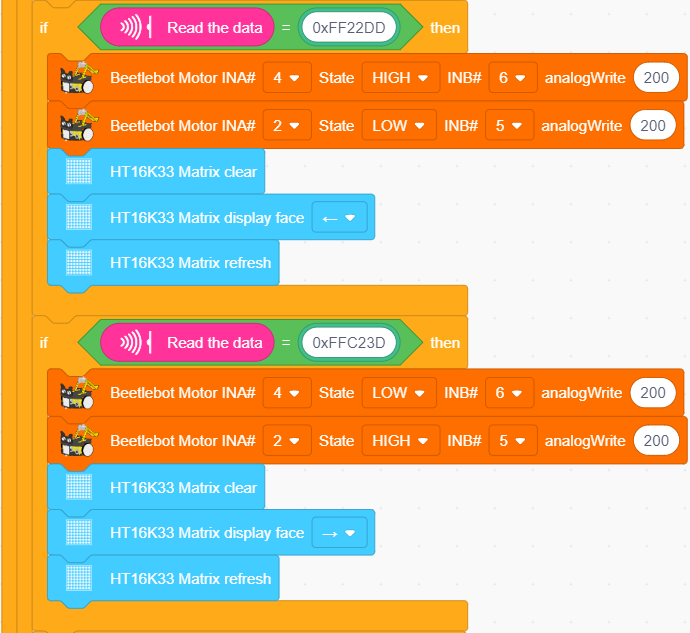

**Test Result：**

Upload the test code to the Arduino Nano motherboard, install batteries, turn
the power switch to the ON end, power up and press a key of the IR remote
control. Then the car will make the corresponding movement.

## Project 11: WIFI Control

In this lesson, we control the car through app. The Beetlebot APP sends
commanders to the WIFI ESP-01 module then transfers to it to the
microcontroller. By doing this, the car can perform different functions.

### Project 11.1: WIFI Test

**1.Description：**

The ESP8266 serial WiFi ESP-01 module is an ultra-low-power UART-WiFi
transparent transmission module and designed for mobile devices and IoT
applications.

It can achieve networking functions by connecting devices to Wifi internet

**2. Components Required**

|                                                    |  | 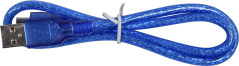 |
|---------------------------------------------------------------------------------------------------|-------------------------------------------------------------------------------------------------------------------|---------------------------------------------------|
| ESP8266 Serial WIFI ESP-01 Module\*1                                                              | USB to ESP-01S WIFI Serial Expansion Board\*1                                                                     | USB Cable\*1                                      |
|  | 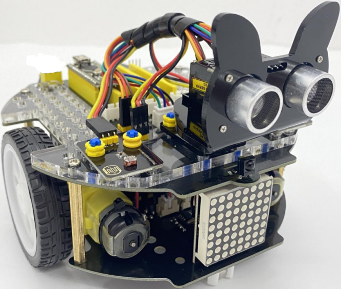                                                                   |                                                   |
| Cellphone/IPad\*1                                                                                 | Beetlebot Car\*1                                                                                                  |                                                   |

**3.Knowledge：**

**USB to ESP-01S WiFi module serial shield:**

It is suitable for the ESP-01S WiFi module. Turn the DIP switch on the USB to
ESP-01S WiFi module serial Expansion Boardto Flash Boot, and plug into
computer’s USB port. You can use serial debugging tool to test the AT command.

Turn the DIP switch on the USB to ESP-01S WiFi module serial expansion board to
the UartDownload, ESP-01 module is at download mode. You can download the
firmware to ESP-01 module using AT firmware.

**ESP8266串口WIFI ESP-01：**

ESP8266 serial WiFi ESP-01 is an ultra-low-power UART-WiFi transparent
transmission module. It can be widely used in smart grids, intelligent
transportation, smart furniture, handheld devices, industrial control and other
fields

**Features**

-   Support wireless 802.11 b/g/n standards

-   Support STA/AP/STA+AP three modes of operation

-   Built-in TCP/IP protocol stack to support multi-channel TCP Client
    connections

-   Supports many Socket AT commands

-   Supports UART / GPIO data communication interface

-   Supports Smart Link smart networking function

-   Supports remote firmware upgrades(OTA)

-   Built-in 32-bit MCU, can also be used as an application processor

-   Ultra-low-power and highly integrated Wi-Fi chip for battery-powered
    applications

-   Working temperature range: -40℃ to + 125℃

-   3.3V single power supply

**Specification：**

| **Module**                          | **Type**                   | ESP8266-01                                                                                                         |
|-------------------------------------|----------------------------|--------------------------------------------------------------------------------------------------------------------|
|                                     | **Main chip**              | ESP8266                                                                                                            |
| **Wireless parameters**             | **Wireless standard**      | IEEE 802.11b/g/n                                                                                                   |
|                                     | **Frequency range**        | 2.412GHz-2.484GHz                                                                                                  |
|                                     | **Transmit power**         | 802.11b: +16 +/-2dBm (@11Mbps)                                                                                     |
|                                     |                            | 802.11g: +14 +/-2dBm (@54Mbps)                                                                                     |
|                                     |                            | 802.11n: +13 +/-2dBm (@HT20, MCS7)                                                                                 |
|                                     | **Receiving sensitivity**  | 802.11b: -93 dBm (@11Mbps ,CCK)                                                                                    |
|                                     |                            | 802.11g: -85dBm (@54Mbps, OFDM)                                                                                    |
|                                     |                            | 802.11n: -82dBm (@HT20, MCS7)                                                                                      |
|                                     | **Antenna type**           | external stamp-hole interfaces                                                                                     |
|                                     |                            | external I-PEX connector and SMA connector                                                                         |
|                                     |                            | Built-in onboard PCB antenna                                                                                       |
| **Hardware parameters**             | **Hardware interfaces**    | UART，IIC，PWM，GPIO，ADC                                                                                          |
|                                     | **Operating voltage**      | 3.3V                                                                                                               |
|                                     | **GPIO drive capability**  | Max：15ma                                                                                                          |
|                                     | **Working current**        | Keep sending down=\> Average：\~70mA Peak: 200mA Normal mode=\> Average: \~12mA Peak: 200mA standby mode：\<200uA  |
|                                     | **Operating temperature**  | -40℃\~125℃                                                                                                         |
|                                     | **Storage environment**    | Temperature：\<40℃ Relative humidity：\<90%R.H                                                                     |
|                                     | **Size**                   | Onboard PCB antenna：14.3mm\*24.8mm\*1mm                                                                           |
| **Serial transparent transmission** | **Transmission rate**      | 110-921600bps                                                                                                      |
|                                     | **TCP Client**             | 5                                                                                                                  |
| **Software Parameters**             | **Wireless network types** | STA/AP/STA+AP                                                                                                      |
|                                     | **Security mechanisms**    | WEP/WPA-PSK/WPA2-PSK                                                                                               |
|                                     | **Encryption types**       | WEP64/WEP128/TKIP/AES                                                                                              |
|                                     | **Firmware upgrade**       | Local serial port, OTA remote upgrade                                                                              |
|                                     | **Network protocols**      | IPv4, TCP/UDP/FTP/HTTP                                                                                             |
|                                     | **User configuration**     | AT + instruction set, web page Android / iOS terminal, Smart Link intelligent configuration APP                    |

**About the Hardware**

ESP8266 has many hardware interfaces, supporting UART, IIC, PWM, GPIO, ADC,
etc., and suitable for a variety of IoT applications.

| **PIN** | **Function**     | **Description**                                                                                                                                              |
|---------|------------------|--------------------------------------------------------------------------------------------------------------------------------------------------------------|
| 1       | URXD             | UART_RXD, receive General Purpose Input/Output：GPIO3                                                                                                        |
| 2       | UTXD             | UART_TXD, send 2）General Purpose Input/Ou tput: GPIO1 3）Do not pull down when power on                                                                     |
| 5       | RESET（GPIO 16） | External Reset signal, LOW reset, HIGH works(default is HIGH)                                                                                                |
| 6       | GND              | GND                                                                                                                                                          |
| 8       | VCC              | 3.3V, power the module                                                                                                                                       |
| 9       | ANT              | WiFi Antenna                                                                                                                                                 |
| 11      | GPIO0            | WiFi Status(Default)：WiFi status indicator control signal Working mode selection: Suspend：Flash Boot，working mode Pull down：UART Download，download mode |
| 12      | ADC              | ADC, input range: 0V-1V                                                                                                                                      |
| 13      | GPIO15           | Pull down：work mode                                                                                                                                         |
| 14      | CH_PD            | Working at HIGH level Power off at LOW level                                                                                                                 |
| 15      | GPIO2            | It must be HIGH level when power on, do not pull down the hardware Internal is pulled up(default)                                                            |

**Power consumption**

The below power consumption data is based on a 3.3V power supply and at
25°ambient temperature.

All measurements are completed at the antenna interface.

All transmitted data is based on 90% duty cycle, which is measured in a
continuous launch mode.

| Mode                                    | Min | Regular | Max | Unit |
|-----------------------------------------|-----|---------|-----|------|
| Send 802.11b，CCK 1Mbps，Pout=+19.5dBm  |     | 215     |     | mA   |
| Send 802.11b，CCK 11Mbps，Pout=+18.5dBm |     | 197     |     | mA   |
| Send 802.11g，OFDM54 Mbps，Pout=+16dBm  |     | 145     |     | mA   |
| Send 802.11n，MCS7，Pout=+14dBm         |     | 135     |     | mA   |
| Receive 802.11b, 1024 bytes, -80dBm     |     | 100     |     | mA   |
| Receive 802.11g, 1024 bytes, -70dBm     |     | 100     |     | mA   |
| Receive 802.11n, 1024 bytes, -65dBm     |     | 102     |     | mA   |
| Standby                                 |     | 70      |     | mA   |
| Shutdown                                |     | 0.5     |     | μA   |

1.  **Radio characteristic：**

The following data were measured when the voltage is 3.3V at room temperature.

| **Description**                       | **Min** | **Regular** | **Max** | **Unit** |
|---------------------------------------|---------|-------------|---------|----------|
| input frequency                       | 2412    |             | 2484    | MHz      |
| input resistance                      |         | 50          |         | Ω        |
| input reflection                      |         |             | -10     | dB       |
| 72.2Mbps下，output power of PA        | 14      | 15          | 16      | dBm      |
| Under the 802.11b，output power of PA | 17.5    | 18.5        | 19.5    | dBm      |
| **Sensitivity**                       |         |             |         |          |
| CCK 1Mbps                             |         | -98         |         | dBm      |
| CCK 11Mbps                            |         | -91         |         | dBm      |
| 6Mbps(1/2BPSK)                        |         | -93         |         | dBm      |
| 54Mbps(3/4 64-QAM)                    |         | -75         |         | dBm      |
| HT20，MCS7（65Mbps，72.2Mbps）        |         | -71         |         | dBm      |
| Adjacent frequency suppression        |         |             |         |          |
| OFDM，6Mbps                           |         | 37          |         | dB       |
| OFDM，54Mbps                          |         | 21          |         | dB       |
| HT20，MCS0                            |         | 37          |         | dB       |
| HT20，MCS7                            |         | 20          |         | dB       |

| **Description**                              | **Min** | **Typ** | **Max** | **Unit** |
|----------------------------------------------|---------|---------|---------|----------|
| Input frequency                              | 2412    |         | 2484    | MHz      |
| Modes                                        | Min     | Typ     | Max     | Unit     |
| Tx 802.11b, CCK 1Mbps, Pout=+19.5dBm         |         | 215     |         | mA       |
| Tx 802.11b, CCK 11Mbps, Pout=+18.5dBm        |         | 197     |         | mA       |
| Tx 802.11g, OFDM54 Mbps, Pout=+16dBm         |         | 145     |         | mA       |
| Tx 802.11n, MCS7, Pout=+14dBm                |         | 135     |         | mA       |
| Rx 802.11b, 1024 bytes packet length, -80dBm |         | 100     |         | mA       |
| Rx 802.11g, 1024 bytes packet length, -70dBm |         | 100     |         | mA       |
| Rx 802.11n, 1024 bytes packet length, -65dBm |         | 102     |         | mA       |
| Standby Mode                                 |         | 70      |         | mA       |
| Power Off                                    |         | 0.5     |         | μA       |

Input resistance

50

Ω

Input reflection

\-10

dB

PA output power at 72.2 Mbps

14

15

16

dBm

PA output power in 802.11b mode

17.5

18.5

19.5

dBm

**Sensitivity**

CCK 1Mbps

\-98

dBm

CCK 11Mbps

\-91

dBm

6Mbps(1/2BPSK)

\-93

dBm

54Mbps(3/4 64-QAM)

\-75

dBm

HT20，MCS7（65Mbps，72.2Mbps）

\-71

dBm

**Adjacent channel rejection**

OFDM，6Mbps

37

dB

OFDM，54Mbps

21

dB

HT20，MCS0

37

dB

HT20，MCS7

20

dB

Note:

1.72.2Mbps is measured in 802.11n mode；

Up to +19.5dBm output power in 802.11b mode.

1.  **（Functions**

**A. Main functions**

The main functions that can be achieved by ESP8266 include: serial port
transparent transmission , PWM regulation, GPIO control.

※Serial port transparent transmission: The transmission is reliable with a
maximum transmission rate of 460800bps.

※PWM regulation: Adjusting lights and tricolor LED, motor speed control, etc.

※GPIO control: Control switch, relay, etc.

1.  **Working modes**

The ESP8266 module supports three operating modes, STA/AP/STA+AP.

❊STA mode: The ESP8266 module can access to the Internet through a router, so
the mobile phone or computer can remotely control the device through the
Internet.

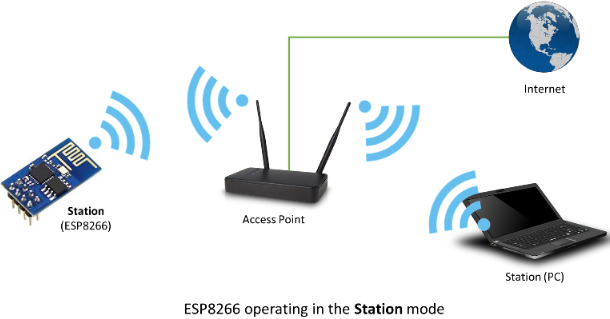

❊AP mode: ESP8266 module, as a hotspot, allows the direct communication with the
module and cellphones/computers, achieving wireless control of the local area
network (LAN).

❊STA+AP mode: two modes coexist, that is, the Internet can achieve free switch

1.  **Applications**

✭✮Serial CH340 to Wi-Fi

✭✮Industrial transparent transmission DTU

✭✮Wi-Fi remote monitoring/control

✭✮Toy industry

✭✮Color LED control

✭✮Integrated management of fire protection and security intelligence

✭✮Smart card terminals, wireless POS machines, Wi-Fi cameras, handheld devices,
etc

**4. Insert the Wifi serial port expansion board into the USB port of your PC**

Insert the ESP8266 serial WIFI ESP-01 module into the USB to ESP-01S WIFI
expansion board.

1.  Turn the DIP switch of the USB to ESP-01S WIF expansion board to
    UartDownload end and plug it to the USB port of your computer

****

1.  **Add the ESP8266 control board：**

Click  to enter the main page,
select the control board needed. In this project, we select the Plus board and
click **Connect.**

Then it is connected,

Click **Go to Editor** to return the code editor.

Icon  will change into
 and
will change into
. This means the Plus board is
connected to the COM port.

If the ESP8266 board is connected , but icon
doesn’t change into
. You need to click
to connect the COM port.

Click  and **Connect.**

Then you will find a page pop up, showing **Connected**

**6. Add the Beetlebot wifi module：**

Clickto enter sensor/module
expansion interface and click“Beetlebot wifi”, “Not loaded”will switch
into“loaded”. Then the Beetlebot wifi module will be added.

Clickto return the code editor,
then you will view the Beetlebot wifi module.

**7.ESP8266 Code：**

If there is no wifi in your home, just enable your shared wifi on the phone

Note：

You need to change the wifi name and password into yours.

Plug the USB to ESP-01S WIFI expansion board to the USB port of the computer ,
turn its DIP switch to the Uart Download end and click“Upload”

Upload the ESP8266 code to the ESP8266 to WIFI ESP-01 module

Note: if the code is uploaded successfully, reboot the ESP-01S WIFI expansion
board.

After the code is uploaded. Unplug the USB to ESP-01S WIFI expansion board and
ESP8266 serial WIFI ESP-01 module.

1.  **Interface the Arduino Nano board**

1.  **Set the interface of Beetlebot app:**

2.  Open KidsBlock to clickto
    enter the main page. Select **Beetlebot**，and click **Connect**，then the
    **Beetlebot car is connected;**

3.  Click“**Go to Editor**” to return code editor,
    will change
    into，and
    into;
    this indicates the device is connected to the port

1.  Then click to switch mode.
    The  will change into
    

**10.Arduino Nano Test Code：**

1.  **Test Result：**

Click **Upload** to upload the test code to the Arduino Nano board.

Then insert the ESP8266 serial WIFI ESP-01module into the WiFi port of the PCB
board.

(Note：keep the USB cable connected)

Click  and set baud rate to 9600.
Then the serial monitor will show your IP address of Wifi.

The IP address of Wifi sometimes changes. If the original doesn’t change, check
the IP address of Wifi again.

**Android system：**

Transfer the file Beetlebot.apk to your cellphone or IPAD, click it to install,
and click“**ALLOW**”→“**INSTALL**”→“**OPEN**”.

Then enter interface of the app. Input the detected Wifi IP address(for example,
the IP address in the above figure is 192.168.1.134), and connect Wifi. At same
time, the IP address will be shown as below, which means that Wifi is connected
well.

**IOS system**

Open App Store

Search Beetlebot，click“”to
download Beetlebot.

The installation instructions are similar with Android system.

**Note: Click buttons on the APP, the blue indicator on the ESP8266 serial WIFI
ESP-01 module will flash, indicating that the APP has been connected to WIFI.**

After the APP has connected to the WIFI, start the following operations:

Click buttons on the app, the serial monitor will print some control characters,
as shown below;

**Interface of App**

Click，a“smile”pattern will be
displayed；click ,“十”will be
shown；click,“❤”will be shown.

### Project 11.2: Multi-purpose Car

In this project we will demonstrate multiple functions of the Beetlebot car
through app.

The code of ESP8266wifi module is not changed, then change the wifi password of
the code into yours.

Upload the code to the Arduino Nano board, as shown
below:

**Test Result**

Clickto control the car to move
in different directions click to
control the SK6812RGB to show different
colors；clickto control the 8\*8
dot matrix display show different patterns.

**10. Resources**

Download code,libraries and more details, please refer to the following link:

[https://fs.keyestudio.com/KS05](https://fs.keyestudio.com/KS0470)43
